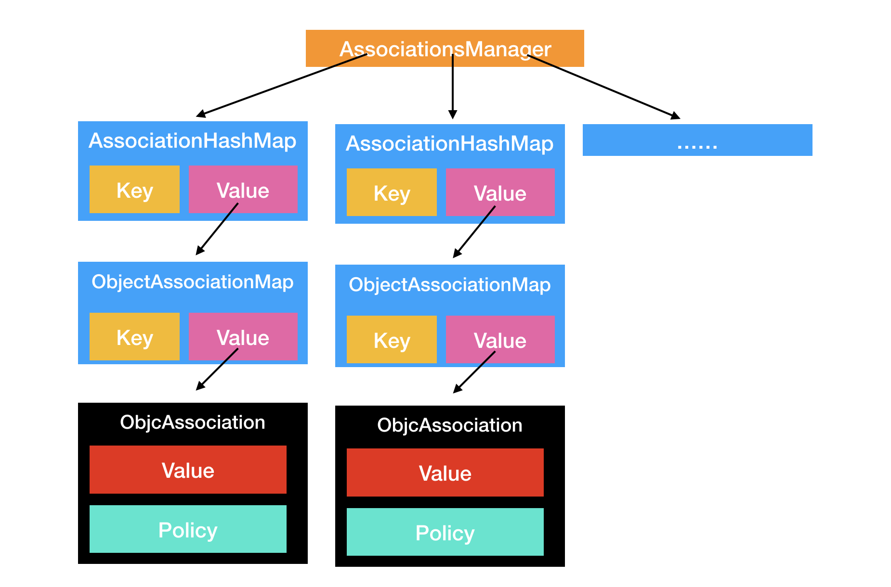

``` objc 
/** 
 * Sets an associated value for a given object using a given key and association policy.
 * 
 * @param object The source object for the association.
 * @param key The key for the association.
 * @param value The value to associate with the key key for object. Pass nil to clear an existing association.
 * @param policy The policy for the association. For possible values, see “Associative Object Behaviors.”
 * 
 * @see objc_setAssociatedObject
 * @see objc_removeAssociatedObjects
 */
OBJC_EXPORT void
objc_setAssociatedObject(id _Nonnull object, const void * _Nonnull key,
                         id _Nullable value, objc_AssociationPolicy policy)
    OBJC_AVAILABLE(10.6, 3.1, 9.0, 1.0, 2.0);

/** 
 * Returns the value associated with a given object for a given key.
 * 
 * @param object The source object for the association.
 * @param key The key for the association.
 * 
 * @return The value associated with the key \e key for \e object.
 * 
 * @see objc_setAssociatedObject
 */
OBJC_EXPORT id _Nullable
objc_getAssociatedObject(id _Nonnull object, const void * _Nonnull key)
    OBJC_AVAILABLE(10.6, 3.1, 9.0, 1.0, 2.0);
```



``` objc
class AssociationsManager {
    // associative references: object pointer -> PtrPtrHashMap.
    static AssociationsHashMap *_map;
public:
    AssociationsManager()   { AssociationsManagerLock.lock(); }
    ~AssociationsManager()  { AssociationsManagerLock.unlock(); }
    
    AssociationsHashMap &associations() {
        if (_map == NULL)
            _map = new AssociationsHashMap();
        return *_map;
    }
};

AssociationsHashMap *AssociationsManager::_map = NULL;
```

``` objc
// expanded policy bits.

enum { 
    OBJC_ASSOCIATION_SETTER_ASSIGN      = 0,
    OBJC_ASSOCIATION_SETTER_RETAIN      = 1,
    OBJC_ASSOCIATION_SETTER_COPY        = 3,            // NOTE:  both bits are set, so we can simply test 1 bit in releaseValue below.
    OBJC_ASSOCIATION_GETTER_READ        = (0 << 8), 
    OBJC_ASSOCIATION_GETTER_RETAIN      = (1 << 8), 
    OBJC_ASSOCIATION_GETTER_AUTORELEASE = (2 << 8)
}; 

```
``` objc
id _object_get_associative_reference(id object, void *key) {
    id value = nil;
    uintptr_t policy = OBJC_ASSOCIATION_ASSIGN;
    {
        AssociationsManager manager;
        AssociationsHashMap &associations(manager.associations());
        disguised_ptr_t disguised_object = DISGUISE(object);
        AssociationsHashMap::iterator i = associations.find(disguised_object);
        if (i != associations.end()) {
            ObjectAssociationMap *refs = i->second;
            ObjectAssociationMap::iterator j = refs->find(key);
            if (j != refs->end()) {
                ObjcAssociation &entry = j->second;
                value = entry.value();
                policy = entry.policy();
                if (policy & OBJC_ASSOCIATION_GETTER_RETAIN) {
                    objc_retain(value);
                }
            }
        }
    }
    if (value && (policy & OBJC_ASSOCIATION_GETTER_AUTORELEASE)) {
        objc_autorelease(value);
    }
    return value;
}
```

