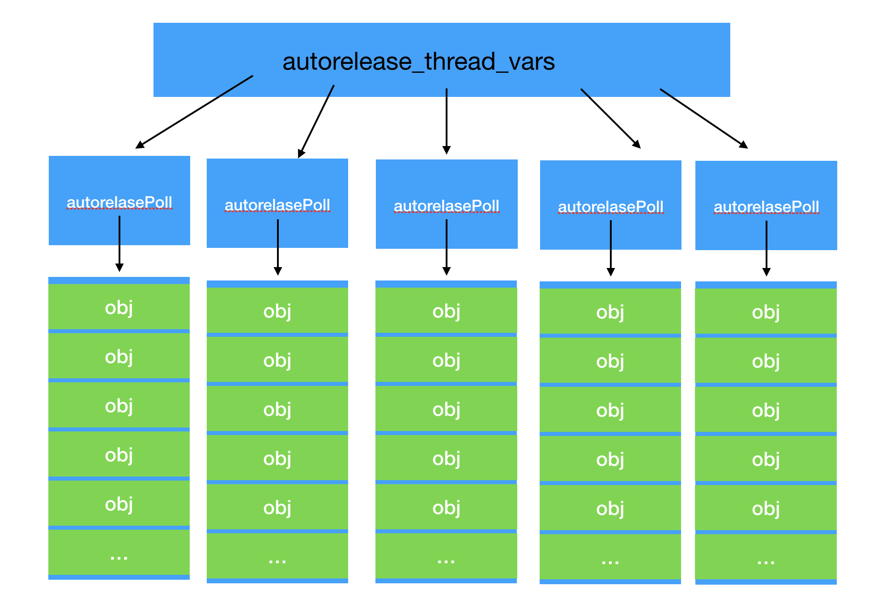

一个线程对应一个autorelease_thread_vars
``` objc
typedef struct autorelease_thread_vars
{
  /* The current, default NSAutoreleasePool for the calling thread;
     the one that will hold objects that are arguments to
     [NSAutoreleasePool +addObject:]. */
  __unsafe_unretained NSAutoreleasePool *current_pool;

  /* The total number of objects autoreleased since the thread was
     started, or since -resetTotalAutoreleasedObjects was called
     in this thread. (if compiled in) */
  unsigned total_objects_count;

  /* A cache of NSAutoreleasePool's already alloc'ed.  Caching old pools
     instead of deallocating and re-allocating them will save time. */
  __unsafe_unretained id *pool_cache;
  int pool_cache_size;
  int pool_cache_count;
} thread_vars_struct;
```

autoreleasePoll
``` objc
@interface NSAutoreleasePool : NSObject 
{
#if	GS_EXPOSE(NSAutoreleasePool) && !__has_feature(objc_arc)
  /* For re-setting the current pool when we are dealloc'ed. */
  NSAutoreleasePool *_parent;
  /* This pointer to our child pool is  necessary for co-existing
     with exceptions. */
  NSAutoreleasePool *_child;
  /* A collection of the objects to be released. */
  struct autorelease_array_list *_released;
  struct autorelease_array_list *_released_head;
  /* The total number of objects autoreleased in this pool. */
  unsigned _released_count;
  /* The method to add an object to this pool */
  void 	(*_addImp)(id, SEL, id);
#endif
#if     GS_NONFRAGILE
#else
  /* Pointer to private additional data used to avoid breaking ABI
   * when we don't have the non-fragile ABI available.
   * Use this mechanism rather than changing the instance variable
   * layout (see Source/GSInternal.h for details).
   */
  @private id _internal GS_UNUSED_IVAR;
#endif
}
```
