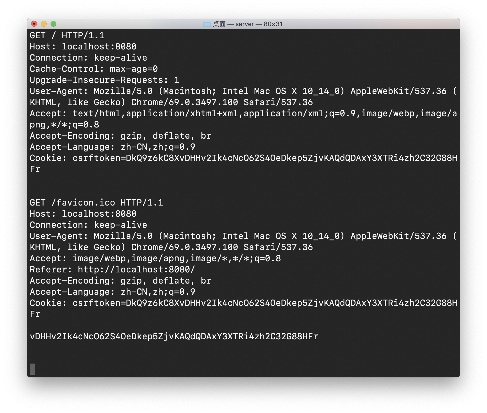
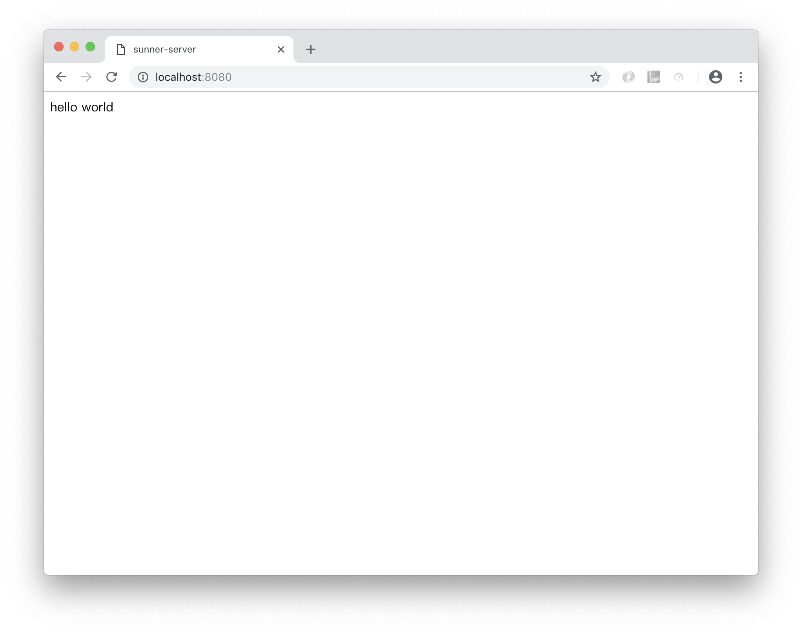
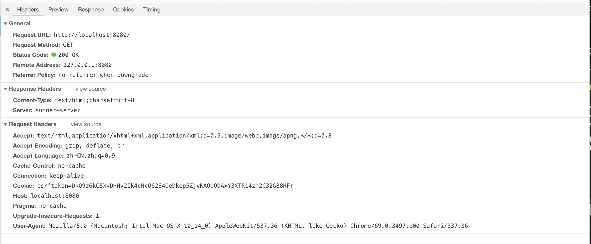

今天研究了一下服务器的实现原理

### server.c

``` c
#include <sys/socket.h>
#include <sys/un.h>
#include <arpa/inet.h>
#include <unistd.h>
#include <string.h>
#include <stdio.h>

#define PROT 8080  // 服务器监听端口

int main()
{
	int server_socket = socket(AF_INET, SOCK_STREAM, 0);

	struct sockaddr_in server_addr;
	memset(&server_addr, 0, sizeof(server_addr));
	server_addr.sin_family = AF_INET;
	server_addr.sin_addr.s_addr = htonl(INADDR_ANY);
	server_addr.sin_port = htons(PROT);

	// bind 
	bind(server_socket, (struct sockaddr *)&server_addr, sizeof(server_addr));

	// listen
	listen(server_socket, 5);


	while(1) {
		// accept
		int client_socket = accept(server_socket, NULL, NULL);

		// read
		char buf[1024];
		read(client_socket, buf, 1024);

		printf("%s\n", buf);

		// write 
		// 响应行
		char status[] = "HTTP/1.0 200 OK\r\n";
		// 响应头
		char header[] = "Server: sunner-server\r\nContent-Type: text/html;charset=utf-8\r\n\r\n";
		// 响应体
		char body[] = "<html><head><title>sunner-server</title></head><body><p>hello world</p></body></html>";

		write(client_socket, status, sizeof(status));
		write(client_socket, header, sizeof(header));
		write(client_socket, body, sizeof(body));

		close(client_socket);
	}

	close(server_socket);

	return 0;
}


```

### 服务器执行



### 浏览器测试



### 抓包



### 下载代码
[code](c-server/c_server.zip)

