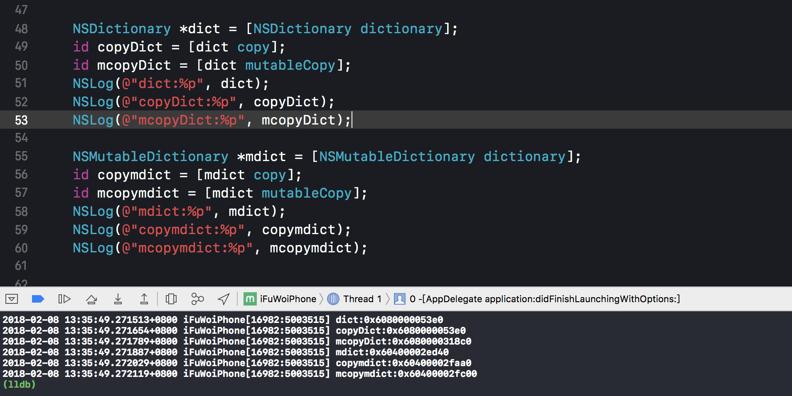

* mutableCopy和copy都是深拷贝，都会开辟空间的。
* copy会产生一个不可变类型，mutableCopy会产生一个可变类型
* 但是在开辟空间的基础上苹果做了一些优化
  * 不可变类型->copy->不可变类型 (不开辟空间)
  * 可变类型->copy->不可变类型 (开辟空间)
  * 不可变类型->mutableCopy->可变类型 (开辟空间)
  * 可变类型->mutableCopy->可变类型 (开辟空间，虽然前后都是可变类型，但是可变类型是需要被修改的，所以必须开辟空间才能保证不会更改之前)

``` objc
    NSDictionary *dict = [NSDictionary dictionary];
    id copyDict = [dict copy];
    id mcopyDict = [dict mutableCopy];
    NSLog(@"dict:%p", dict);
    NSLog(@"copyDict:%p", copyDict);
    NSLog(@"mcopyDict:%p", mcopyDict);
    
    NSMutableDictionary *mdict = [NSMutableDictionary dictionary];
    id copymdict = [mdict copy];
    id mcopymdict = [mdict mutableCopy];
    NSLog(@"mdict:%p", mdict);
    NSLog(@"copymdict:%p", copymdict);
    NSLog(@"mcopymdict:%p", mcopymdict);
```


