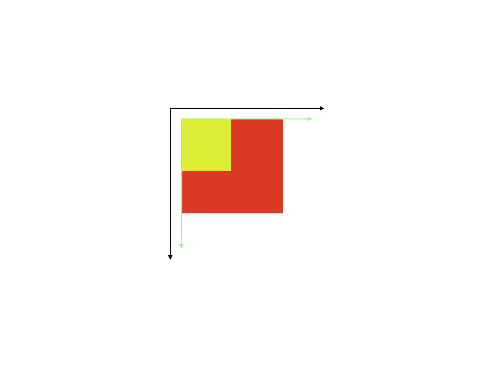
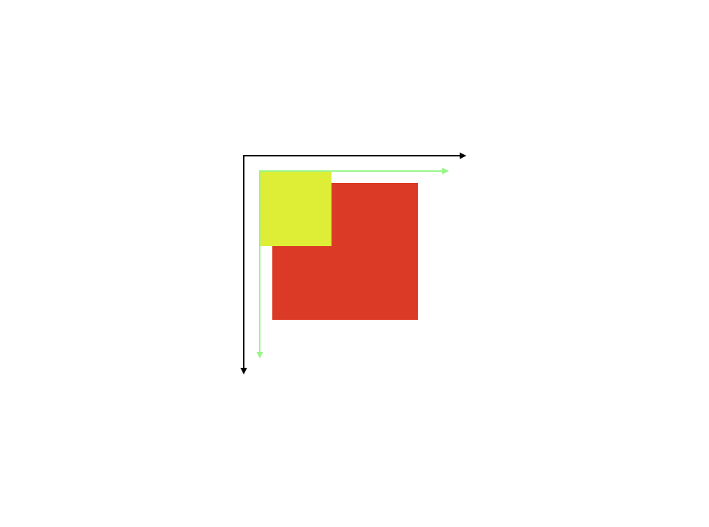
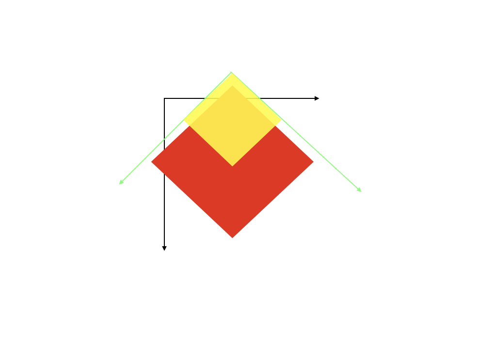
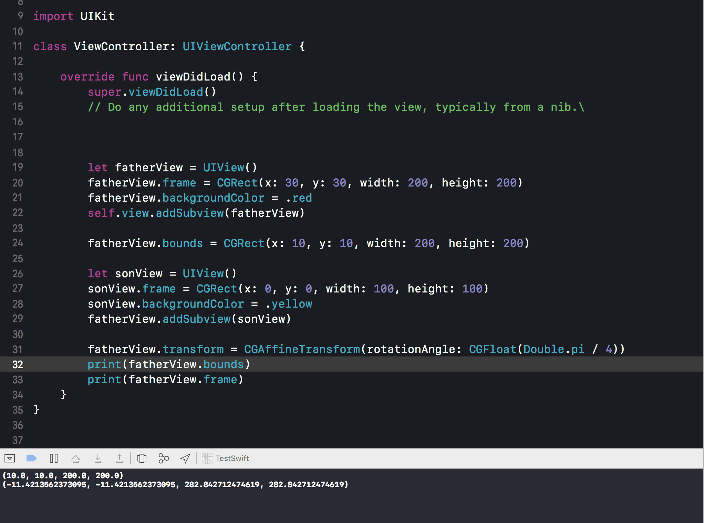

创建一个父视图(fatherView)， 一个子视图(sonView)

``` objc
let fatherView = UIView()
fatherView.frame = CGRect(x: 30, y: 30, width: 200, height: 200)
fatherView.backgroundColor = .red
self.view.addSubview(fatherView)

let sonView = UIView()
sonView.frame = CGRect(x: 0, y: 0, width: 100, height: 100)
sonView.backgroundColor = .yellow
fatherView.addSubview(sonView)

```


更改一下父视图的bounds, 相当于更改了父视图的本地坐标系，父视图的左上角不再是父视图本地坐标系的原点(bounds默认的origin是(0,0))，而是本地坐标系的bounds.origin点.子视图会根据父视图的本地坐标系去布局(frame)。所以子视图的位置会发生改变。

``` objc
let fatherView = UIView()
fatherView.frame = CGRect(x: 30, y: 30, width: 200, height: 200)
fatherView.backgroundColor = .red
self.view.addSubview(fatherView)

fatherView.bounds = CGRect(x: 10, y: 10, width: 200, height: 200)

let sonView = UIView()
sonView.frame = CGRect(x: 0, y: 0, width: 100, height: 100)
sonView.backgroundColor = .yellow
fatherView.addSubview(sonView)

```


当父视图旋转之后，自己的本地坐标系会跟着旋转，相当于子视图的布局没有变化。但是父视图的frame会发生变化。

``` objc
let fatherView = UIView()
fatherView.frame = CGRect(x: 30, y: 30, width: 200, height: 200)
fatherView.backgroundColor = .red
self.view.addSubview(fatherView)

fatherView.bounds = CGRect(x: 10, y: 10, width: 200, height: 200)

let sonView = UIView()
sonView.frame = CGRect(x: 0, y: 0, width: 100, height: 100)
sonView.backgroundColor = .yellow
fatherView.addSubview(sonView)

fatherView.transform = CGAffineTransform(rotationAngle: CGFloat(Double.pi / 4))
print(fatherView.bounds)
print(fatherView.frame)

```




