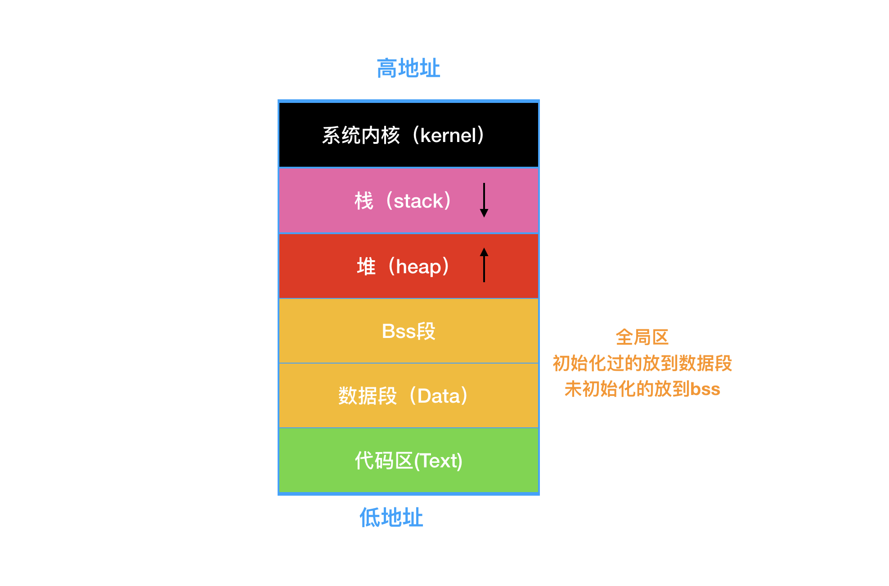
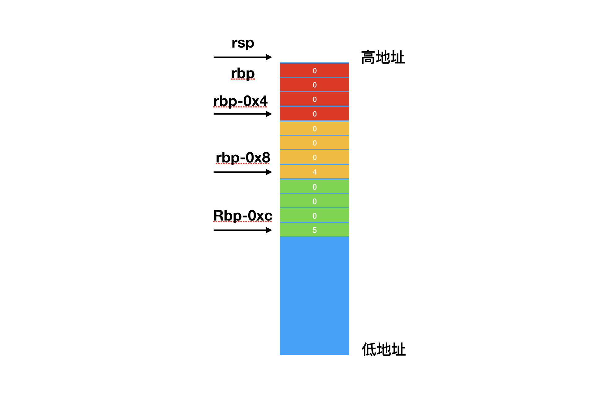

``` c
int main()
{
    int a = 4;
    int b = 5;
    return 0;
}
```
* 设置断点运行
* 找到xcode的导航条
* Debug->Debug Workflow-> Always show Dissambly(勾选)

```
Tets`main:
    0x100000f90 <+0>:  pushq  %rbp
    0x100000f91 <+1>:  movq   %rsp, %rbp
    0x100000f94 <+4>:  xorl   %eax, %eax
    0x100000f96 <+6>:  movl   $0x0, -0x4(%rbp)
    0x100000f9d <+13>: movl   $0x4, -0x8(%rbp)
    0x100000fa4 <+20>: movl   $0x5, -0xc(%rbp)
    0x100000fab <+27>: popq   %rbp
    0x100000fac <+28>: retq  
```


