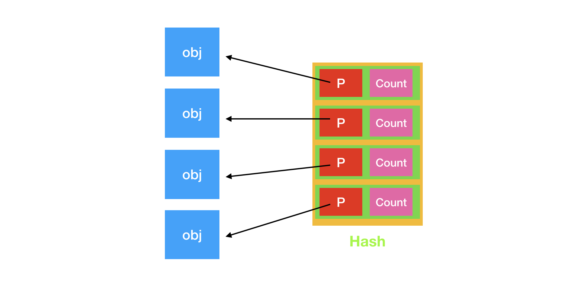
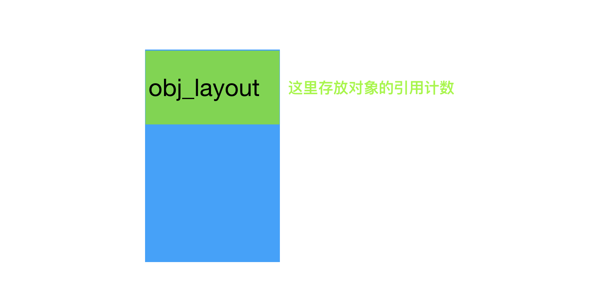

## 苹果的引用计数


## GUN的引用计数



分配内存
``` objc
+ (id) alloc
{
  return [self allocWithZone: NSDefaultMallocZone()];
}

+ (id) allocWithZone: (NSZone*)z
{
  return NSAllocateObject (self, 0, z);
}

struct obj_layout {
  char	padding[__BIGGEST_ALIGNMENT__ - ((UNP % __BIGGEST_ALIGNMENT__)
    ? (UNP % __BIGGEST_ALIGNMENT__) : __BIGGEST_ALIGNMENT__)];
  gsrefcount_t	retained;
};
typedef	struct obj_layout *obj;

inline id
NSAllocateObject (Class aClass, NSUInteger extraBytes, NSZone *zone)
{
  id	new;
  int	size;

  NSCAssert((!class_isMetaClass(aClass)), @"Bad class for new object");
  size = class_getInstanceSize(aClass) + extraBytes + sizeof(struct obj_layout);
  if (zone == 0)
    {
      zone = NSDefaultMallocZone();
    }
  new = NSZoneMalloc(zone, size);
  if (new != nil)
    {
      memset (new, 0, size);
      new = (id)&((obj)new)[1];
      object_setClass(new, aClass);
      AADD(aClass, new);
    }

  /* Don't bother doing this in a thread-safe way, because the cost of locking
   * will be a lot more than the cost of doing the same call in two threads.
   * The returned selector will persist and the runtime will ensure that both
   * calls return the same selector, so we don't need to bother doing it
   * ourselves.
   */
  if (0 == cxx_construct)
    {
      cxx_construct = sel_registerName(".cxx_construct");
      cxx_destruct = sel_registerName(".cxx_destruct");
    }
  callCXXConstructors(aClass, new);

  return new;
}
```
retain操作
``` objc
- (id) retain
{
  NSIncrementExtraRefCount(self);
  return self;
}

inline void
NSIncrementExtraRefCount(id anObject)
{
#if	defined(GSATOMICREAD)
  /* I've seen comments saying that some platforms only support up to
   * 24 bits in atomic locking, so raise an exception if we try to
   * go beyond 0xfffffe.
   */
  if (GSAtomicIncrement((gsatomic_t)&(((obj)anObject)[-1].retained))
    > 0xfffffe)
    {
      [NSException raise: NSInternalInconsistencyException
        format: @"NSIncrementExtraRefCount() asked to increment too far"];
    }
#else	/* GSATOMICREAD */
  NSLock *theLock = GSAllocationLockForObject(anObject);

  [theLock lock];
  if (((obj)anObject)[-1].retained > 0xfffffe)
    {
      [theLock unlock];
      [NSException raise: NSInternalInconsistencyException
        format: @"NSIncrementExtraRefCount() asked to increment too far"];
    }
  ((obj)anObject)[-1].retained++;
  [theLock unlock];
#endif	/* GSATOMICREAD */
}
```
release操作
``` objc
- (oneway void) release
{
  if (NSDecrementExtraRefCountWasZero(self))
    {
#  ifdef OBJC_CAP_ARC
      objc_delete_weak_refs(self);
#  endif
      [self dealloc];
    }
}

inline BOOL
NSDecrementExtraRefCountWasZero(id anObject)
{
  if (double_release_check_enabled)
    {
      NSUInteger release_count;
      NSUInteger retain_count = [anObject retainCount];
      release_count = [autorelease_class autoreleaseCountForObject: anObject];
      if (release_count >= retain_count)
        [NSException raise: NSGenericException
		    format: @"Release would release object too many times."];
    }
  {
#if	defined(GSATOMICREAD)
    gsrefcount_t	result;

    result = GSAtomicDecrement((gsatomic_t)&(((obj)anObject)[-1].retained));
    if (result < 0)
      {
        if (result != -1)
          {
            [NSException raise: NSInternalInconsistencyException
              format: @"NSDecrementExtraRefCount() decremented too far"];
          }
        /* The counter has become negative so it must have been zero.
         * We reset it and return YES ... in a correctly operating
         * process we know we can safely reset back to zero without
         * worrying about atomicity, since there can be no other
         * thread accessing the object (or its reference count would
         * have been greater than zero)
         */
        (((obj)anObject)[-1].retained) = 0;
        return YES;
      }
#else	/* GSATOMICREAD */
    NSLock *theLock = GSAllocationLockForObject(anObject);

    [theLock lock];
    if (((obj)anObject)[-1].retained == 0)
      {
        [theLock unlock];
        return YES;
      }
    else
      {
        ((obj)anObject)[-1].retained--;
        [theLock unlock];
        return NO;
      }
#endif	/* GSATOMICREAD */
  }
  return NO;
}
```

autorelease操作
``` objc
- (id) autorelease
{
  if (double_release_check_enabled)
    {
      NSUInteger release_count;
      NSUInteger retain_count = [self retainCount];
      release_count = [autorelease_class autoreleaseCountForObject:self];
      if (release_count > retain_count)
        [NSException
	  raise: NSGenericException
	  format: @"Autorelease would release object too many times.\n"
	  @"%"PRIuPTR" release(s) versus %"PRIuPTR" retain(s)",
	  release_count, retain_count];
    }

  (*autorelease_imp)(autorelease_class, autorelease_sel, self);
  return self;
}

```

获取引用计数
``` objc 
- (NSUInteger) retainCount
{
  return NSExtraRefCount(self) + 1;
}

inline NSUInteger
NSExtraRefCount(id anObject)
{
  return ((obj)anObject)[-1].retained;
}

```

对象释放
``` objc
inline void
NSDeallocateObject(id anObject)
{
  Class aClass = object_getClass(anObject);

  if ((anObject != nil) && !class_isMetaClass(aClass))
    {
      obj	o = &((obj)anObject)[-1];
      NSZone	*z = NSZoneFromPointer(o);

      /* Call the default finalizer to handle C++ destructors.
       */
      (*finalize_imp)(anObject, finalize_sel);

      AREM(aClass, (id)anObject);
      if (NSZombieEnabled == YES)
	{
	  GSMakeZombie(anObject, aClass);
	  if (NSDeallocateZombies == YES)
	    {
	      NSZoneFree(z, o);
	    }
	}
      else
	{
	  object_setClass((id)anObject, (Class)(void*)0xdeadface);
	  NSZoneFree(z, o);
	}
    }
  return;
}

```
***

